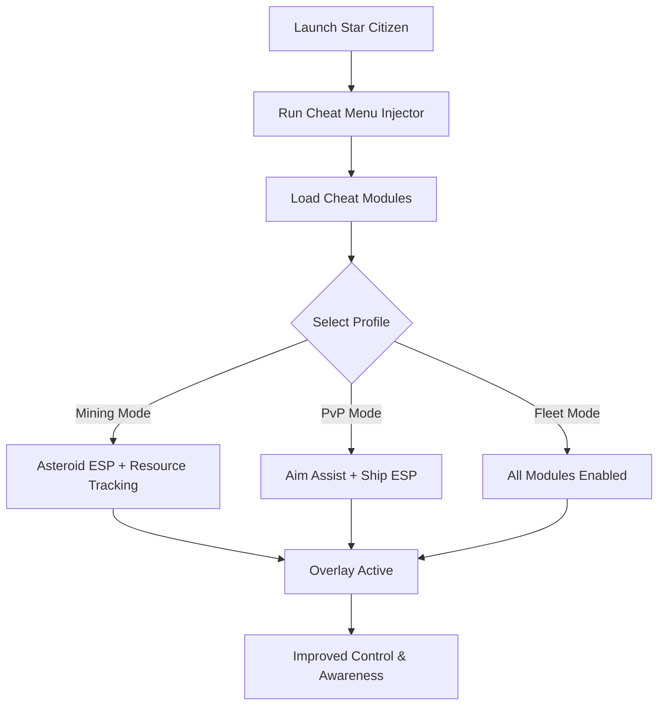

# Star Citizen Cheat Menu 🚀

**Star Citizen** delivers one of the most ambitious space simulations ever created—vast star systems, complex ship mechanics, and high-stakes combat. But with scale comes challenge. The **Star Citizen Cheat Menu** provides an all-in-one interface for **ESP overlays, aim assist, and resource scanning**, giving you unmatched awareness across the galaxy.

---

## 🌐 Overview

Instead of juggling radar, ship systems, and terrain maps, this cheat menu puts everything at your fingertips. Toggle modules for **ship combat, exploration, or resource mining** with hotkeys, or create custom profiles tailored for your playstyle. Lightweight injection ensures stable performance even during large-scale battles.

---

## 🔑 Features

* 👁 **ESP Overlay** – Highlight ships, NPCs, players, and loot.
* 🎯 **Aim Assist** – Configurable FOV and smooth lock-on for ship and FPS combat.
* 🪐 **Resource ESP** – Scan and highlight asteroids, minerals, and trade goods.
* 📡 **Radar Enhancements** – Extended detection for hostile ships.
* ⚡ **Weapon Stabilizer** – Reduces recoil in FPS or ship turrets.
* 🗂 **Profile Loader** – Save configs for mining, PvP, or fleet operations.
* ⌨️ **Hotkey Switching** – Instant toggles mid-flight or on foot.
* 🔒 **Stealth Injection** – Secure and optimized for Windows PCs.

---

[](#)
[](#)
[](#)
[](#)

---

## 🖥 Compatibility

| Platform       | Status        | Notes                         |
| -------------- | ------------- | ----------------------------- |
| Windows 10     | ✅ Supported   | Stable cheat menu builds      |
| Windows 11     | ✅ Optimized   | Smooth overlays               |
| Linux (Proton) | ⚠️ Partial    | ESP works, aim assist limited |
| macOS          | ❌ Unsupported | VM workaround only            |

\[!NOTE]
The menu runs best on **Windows 10/11** with DirectX.

---

## ⚙️ Setup Guide

1. Download the Star Citizen Cheat Menu.

2. Extract into a secure folder.

3. Launch Star Citizen.

4. Run the injector as administrator:

   ```bash
   starcitizen_cheatmenu.exe -game starcitizen.exe -mode stealth
   ```

5. Configure `config.ini`:

   ```ini
   [AimAssist]
   FOV=95
   Smoothness=6
   Target=Chest
   Hotkey=Mouse4

   [ESP]
   Ships=True
   Players=True
   Asteroids=True
   Loot=True
   ShipColor=Red
   PlayerColor=Blue
   AsteroidColor=Yellow
   ```

6. Open menu with `Insert`.

\[!IMPORTANT]
Inject **after game load** for proper module hooks.

---

## 📊 Cheat Workflow



---

## 🎚 Example Configurations

**Mining Profile:**

```ini
Asteroids=True
Loot=True
Ships=False
```

**PvP Dogfight Profile:**

```ini
Ships=True
Players=True
Smoothness=7
FOV=85
```

**Fleet Hybrid Profile:**

```ini
Ships=True
Players=True
Asteroids=True
Loot=True
```

\[!WARNING]
Running too many ESP layers at once can clutter HUD displays—use specialized profiles.

---

## ❓ FAQ

**Q: Does the cheat menu hurt FPS?**
A: No, it’s optimized to run with <3% performance cost.

**Q: Can I switch profiles mid-flight?**
A: Yes, hotkeys enable instant toggling.

**Q: Does it work in both FPS and ship combat?**
A: Yes, modules are dual-mode compatible.

**Q: Do updates track Star Citizen patches?**
A: Yes, new builds roll out with game updates.

**Q: Is stealth injection fully safe?**
A: It lowers risk but no cheat is 100% undetectable.

---

## 🚀 Final Thoughts

The **Star Citizen Cheat Menu** combines **ESP overlays, aim assist, and resource scanning** into a single package. Whether mining asteroids, engaging in PvP dogfights, or coordinating fleet operations, it ensures better awareness and precision in the vast verse.

[](#)
[](#)
[](#)

---
